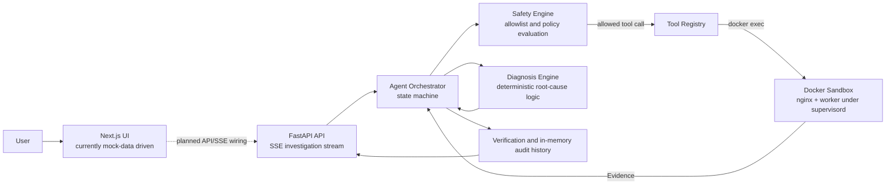

# NEXUS

**NEXUS** is an evidence-first, closed-loop Linux Operations Assistant built by **Team 383** for **C-DAC Hackathons 2026, Problem Statement 2**.

It is not an LLM that generates shell commands. The LLM may select from a fixed set of named tools, but every tool call is validated by a safety engine before it can reach the Linux sandbox. NEXUS collects real evidence, applies deterministic diagnosis logic, previews state-changing work for approval, executes only after approval, verifies the result, and retains completed records in memory for the lifetime of the backend process.

## Operating Philosophy

NEXUS follows a closed loop:

**Understand -> Observe -> Investigate -> Diagnose -> Explain -> Preview -> Safety check -> Approval -> Execute -> Verify -> Remember**

- **Understand and observe:** accept an operations query and gather structured evidence from allowlisted tools.
- **Investigate and diagnose:** the orchestrator drives collection; the diagnosis engine applies inspectable thresholds to collected evidence.
- **Explain and preview:** diagnosis and proposed actions are emitted as structured events, including risk information.
- **Safety check, approval, and execution:** the Safety Engine evaluates every proposed tool call. Medium- and high-risk actions require a separate approval request before execution.
- **Verify and remember:** approved actions are revalidated, verified, and successful `OperationRecord` values are held in the backend's in-memory history.

## Architecture



### Runtime Layers

1. **FastAPI + SSE** exposes investigation, action approval/denial, history, and health endpoints. Investigation progress is streamed as Server-Sent Events.
2. **Agent Orchestrator** owns the investigation state machine and is the only route from the API to the execution flow.
3. **Safety Engine** validates a structured `ToolCall` before the registry can run it.
4. **Tool Registry** invokes named Linux commands inside the configured Docker sandbox through `docker exec`.
5. **Docker Sandbox** runs nginx and a memory-pressure worker under supervisord, with reversible memory and nginx-configuration fault scenarios.
6. **Diagnosis Engine** evaluates collected evidence using deterministic thresholds rather than an LLM-provided confidence score.

## Current Status

- The Python backend implements FastAPI endpoints, SSE investigation progress, action approval/denial, a health endpoint, and in-memory operation history.
- The sandbox is a real Docker environment with nginx and a supervised `worker.py` process. It includes reversible memory-pressure and nginx-configuration fault scenarios.
- The tool registry currently exposes nine callable operations: memory, CPU, disk, processes, service status, logs, ports, service restart, and process termination. Its commands are routed to the sandbox container.
- The diagnosis tests cover three deterministic scenarios; the Safety Engine red-team suite contains twelve tests. The backend test suite currently contains fifteen tests in total.
- The Next.js UI is **not yet connected to the live API**. It imports mock data from `frontend/lib/mock-data.ts`; no frontend API or SSE client is implemented yet.
- History is intentionally in-memory only. It is lost when the backend process restarts; no database or persistent audit store is implemented.

## Tech Stack

### Backend

Versions below are taken directly from `backend/requirements.txt`.

| Dependency | Version |
| --- | --- |
| Pydantic | `>=2.9` |
| pytest | `8.3.2` |
| Groq Python SDK | `1.6.0` |
| FastAPI | `0.112.0` |
| Uvicorn | `0.30.6` |
| sse-starlette | `2.1.3` |

### Frontend

Versions below are taken directly from `frontend/package.json`.

| Dependency | Version |
| --- | --- |
| Next.js | `16.3.1` |
| React | `19.2.8` |
| React DOM | `19.2.8` |
| @base-ui/react | `^1.7.0` |
| class-variance-authority | `^0.7.1` |
| clsx | `^2.1.1` |
| lucide-react | `^1.33.0` |
| shadcn | `^4.18.0` |
| tailwind-merge | `^3.6.0` |
| tw-animate-css | `^1.4.0` |
| @tailwindcss/postcss | `^4` |
| @types/node | `^20` |
| @types/react | `^19` |
| @types/react-dom | `^19` |
| eslint | `^9` |
| eslint-config-next | `16.3.1` |
| tailwindcss | `^4` |
| typescript | `^5` |

The frontend scripts are `npm run dev`, `npm run build`, `npm run start`, and `npm run lint`.

## Run Locally

### Prerequisites

- Git
- Docker Desktop or Docker Engine with Docker Compose v2
- Python 3.10 or later
- Node.js and npm
- A Groq API key for live LLM-driven investigations

### 1. Clone the repository

Replace `<repository-url>` with the repository location:

```bash
git clone <repository-url> nexus
cd nexus
```

### 2. Configure the API key

Copy the template and add your own key locally. The template contains no secret.

```bash
copy backend\.env.example backend\.env
```

On macOS or Linux, use:

```bash
cp backend/.env.example backend/.env
```

Set `GROQ_API_KEY` from `backend/.env` in the shell that starts Uvicorn. For example, in PowerShell:

```powershell
Get-Content backend/.env | ForEach-Object {
  if ($_ -match '^(?<name>[^=]+)=(?<value>.*)$') {
    [Environment]::SetEnvironmentVariable($Matches.name, $Matches.value, 'Process')
  }
}
```

For Bash:

```bash
set -a
. backend/.env
set +a
```

`GROQ_API_KEY` is read from the process environment. Do not commit `backend/.env` or place keys in source code.

### 3. Start the Docker sandbox

From the repository root:

```bash
docker compose up -d --build
docker compose ps
```

The default container is `nexus-sandbox`, and nginx is published on `http://localhost:8080`. The tool registry uses this container name by default; set `NEXUS_SANDBOX_CONTAINER` before starting the backend if a deployment uses another name.

### 4. Start the backend

Create and activate a virtual environment, then install the pinned backend dependencies:

```powershell
python -m venv .venv
.\.venv\Scripts\Activate.ps1
python -m pip install -r backend/requirements.txt
```

Start the API from `backend/`:

```powershell
Set-Location backend
uvicorn app.main:app --reload --port 8000
```

The unauthenticated health check is available at `http://localhost:8000/api/health`.

The default CORS origin is restricted to `http://localhost:3000`. Set `NEXUS_FRONTEND_ORIGIN` before starting the backend only when the frontend runs on a different origin.

### 5. Start the frontend

In a separate terminal, from the repository root:

```bash
cd frontend
npm install
npm run dev
```

Open `http://localhost:3000`. The UI currently renders mock data and does not yet call the backend.

## API Surface

| Method | Path | Purpose |
| --- | --- | --- |
| `POST` | `/api/investigate` | Starts an orchestration and streams state/payload events over SSE. |
| `POST` | `/api/actions/{action_id}/approve` | Executes a pending action through its originating orchestrator. |
| `POST` | `/api/actions/{action_id}/deny` | Marks a pending action as denied without executing it. |
| `GET` | `/api/history` | Returns completed records retained in memory. |
| `GET` | `/api/health` | Returns `{"status":"ok"}`. |

## Safety Model

NEXUS uses structured data contracts and a layered safety policy rather than asking an LLM to compose shell text.

- **Risk tiers:** the data contract recognizes `READ_ONLY`, `LOW`, `MEDIUM`, `HIGH`, and `BLOCKED`.
- **Allowlisted tools:** the model can select only named tools and structured arguments. It cannot send arbitrary shell commands to the registry.
- **Layered validation:** the Safety Engine checks tool allowlisting, per-tool argument values and types where applicable, safe paths where relevant, risk classification, and approval requirements.
- **Human approval:** `MEDIUM` and `HIGH` risk calls require approval before execution. Approval does not bypass safety; actions are evaluated again at execution time.
- **No direct LLM-to-shell path:** the orchestrator calls `safety_engine.evaluate()` before any registry function is used. The registry invokes commands with `shell=False` and a fixed argument vector.
- **Bounded execution:** registry calls use a timeout and cap returned output. Docker/sandbox reachability failures are returned as evidence markers rather than Python tracebacks.

## Problem Statement

**AI-Powered Linux Operations Assistant Using Natural Language Queries**

> Develop an AI assistant that allows users to interact with Linux using
> natural language instead of complex commands. It should diagnose system
> issues, search files and documents, and provide easy-to-understand
> solutions and recommended Linux commands.

## Team

- **Team:** 383
- **Event:** C-DAC Hackathons 2026
- **Problem Statement:** 2

## Security

See [SECURITY.md](SECURITY.md) for the safety model, secret-handling guidance, and vulnerability reporting.
